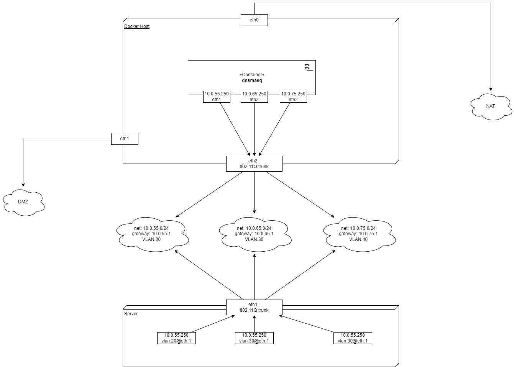

# docker-dns-dhcp-vlan

Run DHCP/DNS as Docker container in mutli-VLAN configuration

## Useful links

- https://hicu.be/docker-networking-macvlan-vlan-configuration
- https://github.com/networkboot/docker-dhcpd
- [Why use `service: 2` in docker-compose for IPVLAN mode networks instead of v3](https://github.com/docker/docker.github.io/pull/1636)
- [ISC DHCP examples for Ubuntu](https://help.ubuntu.com/community/isc-dhcp-server)


## Testing

Repository provides `Vagrantfile` with two Ubuntu VMs:

- The first host for running Docker
- The second host for aquire DHCP lease from DHCPd running as Docker container on the first host

All you need to do is to install Docker on the first VM (manually or with [./ansible](ansible)), provide `docker-compose.yml` file and test that out.
## How it works

Let's suppose we have the following config:



You have corporate network separated by VLANs. In this configuration we suppose we have three VLANs:

- VLAN 20
- VLAN 30
- VLAN 40

You can change the list and add another VLANs if you need.

Here you have two servers:

- One host running Docker - the host does not have explicit subinterfaces on `eth2` running as 802.11Q Trunk interface. Docker  host should create subsequent VLANs when running Docker container in the VLAN networks
- Second host - this host will try to aqcuire network configuration from DHCP server running in Docker. It should already have VLAN subinterfaces configured (for Ubuntu see example provision script (dhcp_client_provision.sh)[./dhcp_client_provision.sh]).

Your second host networks can be as follows:

```shell
> ip link

...
5: vlan.20@eth2: <BROADCAST,MULTICAST,UP,LOWER_UP> mtu 1500 qdisc noqueue state UP group default
qlen 1000
    link/ether 08:00:27:0e:e1:f1 brd ff:ff:ff:ff:ff:ff
    inet 10.0.55.240/24 brd 10.0.55.255 scope global vlan.20
       valid_lft forever preferred_lft forever
    inet6 fe80::a00:27ff:fe0e:e1f1/64 scope link
       valid_lft forever preferred_lft forever
...
6: vlan.30@eth2: <BROADCAST,MULTICAST,UP,LOWER_UP> mtu 1500 qdisc noqueue state UP group default
qlen 1000
    link/ether 08:00:27:0e:e1:f1 brd ff:ff:ff:ff:ff:ff
    inet 10.0.65.240/24 brd 10.0.65.255 scope global vlan.30
       valid_lft forever preferred_lft forever
    inet6 fe80::a00:27ff:fe0e:e1f1/64 scope link
       valid_lft forever preferred_lft forever
...
9: vlan.40@eth2: <BROADCAST,MULTICAST,UP,LOWER_UP> mtu 1500 qdisc noqueue state UP group default
qlen 1000
    link/ether 08:00:27:0e:e1:f1 brd ff:ff:ff:ff:ff:ff
    inet 10.0.75.240/24 brd 10.0.75.255 scope global vlan.40
       valid_lft forever preferred_lft forever
    inet6 fe80::a00:27ff:fe0e:e1f1/64 scope link
       valid_lft forever preferred_lft forever
```

Here is a `docker-compose.yml` in (dhcp)[./dhcp] folder.

Run it:

```shell
> docker-compose build
> docker-compose up

Creating network "vagrant_nat" with the default driver
Creating network "vagrant_vlan20" with driver "ipvlan"
Creating network "vagrant_vlan30" with driver "ipvlan"
Creating network "vagrant_vlan40" with driver "ipvlan"
Creating vagrant_dhcpd_1 ... done
```

When starting docker-compose, Docker creates subsequent IPVLAN network interfaces and attach them to your container. On the Docker host you can see additional VLAN interfaces:

```shell
...
55: eth2.20@eth2: <BROADCAST,MULTICAST,UP,LOWER_UP> mtu 1500 qdisc noqueue state UP group default
    link/ether 08:00:27:f8:31:dd brd ff:ff:ff:ff:ff:ff
    inet6 fe80::a00:27ff:fef8:31dd/64 scope link
       valid_lft forever preferred_lft forever
56: eth2.30@eth2: <BROADCAST,MULTICAST,UP,LOWER_UP> mtu 1500 qdisc noqueue state UP group default
    link/ether 08:00:27:f8:31:dd brd ff:ff:ff:ff:ff:ff
    inet6 fe80::a00:27ff:fef8:31dd/64 scope link
       valid_lft forever preferred_lft forever
57: eth2.40@eth2: <BROADCAST,MULTICAST,UP,LOWER_UP> mtu 1500 qdisc noqueue state UP group default
    link/ether 08:00:27:f8:31:dd brd ff:ff:ff:ff:ff:ff
    inet6 fe80::a00:27ff:fef8:31dd/64 scope link
       valid_lft forever preferred_lft forever
...
```

On the second host your VLAN-ed network interfaces receives additional IP addresses:

```shell
5: vlan.20@eth2: <BROADCAST,MULTICAST,UP,LOWER_UP> mtu 1500 qdisc noqueue state UP group default qlen 1000
    link/ether 08:00:27:0e:e1:f1 brd ff:ff:ff:ff:ff:ff
    inet 10.0.55.240/24 brd 10.0.55.255 scope global vlan.20
       valid_lft forever preferred_lft forever
    inet 10.0.55.50/24 brd 10.0.55.255 scope global secondary dynamic vlan.20
       valid_lft 4073sec preferred_lft 4073sec
    inet6 fe80::a00:27ff:fe0e:e1f1/64 scope link
       valid_lft forever preferred_lft forever
...
6: vlan.30@eth2: <BROADCAST,MULTICAST,UP,LOWER_UP> mtu 1500 qdisc noqueue state UP group default qlen 1000
    link/ether 08:00:27:0e:e1:f1 brd ff:ff:ff:ff:ff:ff
    inet 10.0.65.240/24 brd 10.0.65.255 scope global vlan.30
       valid_lft forever preferred_lft forever
    inet 10.0.65.50/24 brd 10.0.65.255 scope global secondary dynamic vlan.30
       valid_lft 4069sec preferred_lft 4069sec
    inet6 fe80::a00:27ff:fe0e:e1f1/64 scope link
       valid_lft forever preferred_lft forever
...
9: vlan.40@eth2: <BROADCAST,MULTICAST,UP,LOWER_UP> mtu 1500 qdisc noqueue state UP group default qlen 1000
    link/ether 08:00:27:0e:e1:f1 brd ff:ff:ff:ff:ff:ff
    inet 10.0.75.240/24 brd 10.0.75.255 scope global vlan.40
       valid_lft forever preferred_lft forever
    inet 10.0.75.50/24 brd 10.0.75.255 scope global secondary dynamic vlan.40
       valid_lft 4060sec preferred_lft 4060sec
    inet6 fe80::a00:27ff:fe0e:e1f1/64 scope link
       valid_lft forever preferred_lft forever
```

Now run on the second host `dhclient` command and now your host will aqcuire network configuration via DHCP:

```shell
> dhclient vlan.20
> dhclient vlan.30
> dhclient vlan.40
```

On the Docker host run `docker-compose logs -f` and you will see the ISC DHCP container actually receives DHCP requests:

```shell
dhcpd_1  | Listening on LPF/eth3/08:00:27:f8:31:dd/10.0.75.0/24
dhcpd_1  | Sending on   LPF/eth3/08:00:27:f8:31:dd/10.0.75.0/24
dhcpd_1  | Listening on LPF/eth2/08:00:27:f8:31:dd/10.0.65.0/24
dhcpd_1  | Sending on   LPF/eth2/08:00:27:f8:31:dd/10.0.65.0/24
dhcpd_1  | Sending on   Socket/fallback/fallback-net
dhcpd_1  | Server starting service.
dhcpd_1  | DHCPREQUEST for 10.0.55.50 from 08:00:27:0e:e1:f1 (vagrant) via eth1
dhcpd_1  | ns1.example.org: host unknown.
dhcpd_1  | ns2.example.org: host unknown.
dhcpd_1  | DHCPACK on 10.0.55.50 to 08:00:27:0e:e1:f1 (vagrant) via eth1
dhcpd_1  | DHCPREQUEST for 10.0.65.50 from 08:00:27:0e:e1:f1 (vagrant) via eth2
dhcpd_1  | DHCPACK on 10.0.65.50 to 08:00:27:0e:e1:f1 (vagrant) via eth2
dhcpd_1  | DHCPREQUEST for 10.0.75.50 from 08:00:27:0e:e1:f1 (vagrant) via eth3
dhcpd_1  | DHCPACK on 10.0.75.50 to 08:00:27:0e:e1:f1 (vagrant) via eth3
```

As the summary, now we can run DHCPd server in the Docker, serving on requests from VLAN-isolated networks.


You can modify this example, but be aware:

- You should extend `docker-compose.yml` with your VLANs. Make sure you provide correct `ip_range` from which container will be assigned an IP address.
- Also modify [dhcp/data/dhcpd.conf](dhcp/data/dhcpd.conf) with requred options and network ranges actually used on your network (ISC DHCP)[https://kb.isc.org/docs/isc-dhcp-41-manual-pages-dhcpdconf].


## Useful commands

### DCHP-Docker

```shell
# manually create docker network in VLAN 20
docker network  create  -d ipvlan  \
    --subnet=10.0.55.0/24 \
    -o parent=eth2.20 \
    vlan20

# manually create docker network in VLAN 30
docker network  create  -d ipvlan  \
    --subnet=10.0.65.0/24 \
    -o parent=eth2.30 \
    vlan30

# manually create docker network in VLAN 40
docker network  create  -d ipvlan  \
    --subnet=10.0.75.0/24 \
    -o parent=eth2.40 \
    vlan40

# Run alpine with attached net in VLAN 20. Useful if you want to test ping command
docker run --net=vlan20 --ip=10.0.55.20 --rm -it --entrypoint /bin/sh alpine
# Run curl image with attached net in VLAN 20. Useful if you want to test HTTP connectivity
docker run --net=vlan20 --ip=10.0.55.30 --rm -it --entrypoint /bin/sh curlimages/curl

# Remove docker network in VLAN 20. Make sure you don't have active connections (running/existing containers) attached to the net, otherwise deletion will fail
docker network rm vlan20

# Run ISC DHCP container attached to VLAN.20, container has static IP address - 10.0.55.30
docker run --net=vlan20 --ip=10.0.55.30 -v $PWD/dhcp/data:/data --rm dhcpd
# Then attach additional net interface in VLAN 30
docker network connect vlan30 --ip 10.0.65.30 a12933e24840de8cc94bb4942ef88347234126cc022d981db17bfc128bf1bdee
```

### DHCP-Client

```shell
docker network  create  -d macvlan \
    --subnet=10.0.55.0/24 \
    --gateway=10.0.55.10 \
    -o parent=eth2.20 \
    vlan20

docker run --net=vlan20 --ip=10.0.55.40 --rm -it --entrypoint /bin/sh alpine ping -c 4 10.0.55.30

docker network rm vlan20
```